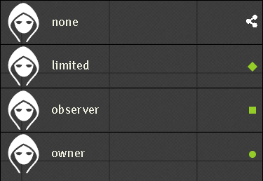
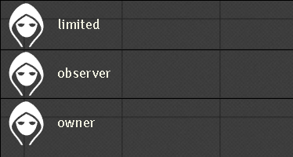

# Hidden Entity Links

 

 

[](https://forge-vtt.com/bazaar#package=hidden-entity-links) 


[](https://www.foundryvtt-hub.com/package/hidden-entity-links/)

 

A module for FoundryVTT which hides entities in the sidebar if players have Limited access to them. This means you can provide secret documents to your players without them seeing them in the sidebar.


## Instructions

In the module settings you will find options to hide each entity type (apart from Macros) from your players if they have limited access.

The concept is hide everything on the sidebar, but still have permissions , a classic use is a merchant in apsecific scene cna be used only on that scene not on the sidebar.

The graphic interaction with new choices on the sidebar context let you decide the entity/document you want to make secret with a simple right click on the specific element or the folder of the sidebar, so you can hide , unhide multiple elements with one click.

There is a integration based on the permission applied on the entities.

## Installation

It's always easiest to install modules from the in game add-on browser.

To install this module manually:
1.  Inside the Foundry "Configuration and Setup" screen, click "Add-on Modules"
2.  Click "Install Module"
3.  In the "Manifest URL" field, paste the following url:
`https://raw.githubusercontent.com/p4535992/vtt-hidden-entity-links/master/module.json`
1.  Click 'Install' and wait for installation to complete
2.  Don't forget to enable the module in game using the "Manage Module" button

### libWrapper

This module uses the [libWrapper](https://github.com/ruipin/fvtt-lib-wrapper) library for wrapping core methods. It is a hard dependency and it is recommended for the best experience and compatibility with other modules.

### socketLib [OPTIONAL] (need some more developing...)
This module uses the [socketLib](https://github.com/manuelVo/foundryvtt-socketlib) library for socket core methods. It is a hard dependency and it is recommended for the best experience and compatibility with other modules.

## Known issue

- I hate myself for this, but I could not find a way to update the elements on the sidebar to change the flag on the entities the method ui.sidebar.render (true); it should have worked, but that doesn't seem to be the case ... if anyone can find a solution let me know. FOR NOW YOU ARE FORCED TO REFRESH THE WEB PAGE.
- When change the modules setting it's required (preferable) A REFRESH OF THE WEB PAGE.

## Features


### Hide entity with right cick context integration

You can force to hide some specifc entity.

NOTE: this bypass the check used with the feature "Permission manager integration".


### Show entity with right click context integration

From version 1.0.7 you can force to show some entity.

NOTE: this bypass the check used with the feature "Permission manager integration".


## Unhide/Unshow entity with right click context integration

From version 1.0.7 you can remove the flag of hidden with a voice on the right context.

By module settings we can apply the css style to all the entites are not hide or show


### Permission manager integration 

From version 1.0.7 you can hide by default the entites based on the permissions level of the player, it very hard to mantain trace of this so for this feature it is highly recommended to install and use this module together with the module **[Permission Viewer](https://github.com/League-of-Foundry-Developers/fvtt-module-permission-viewer)**

On the module setting you can see a dropdown menu where to choose the permission level to set for the specific type.


Remember the permission on foundry are from lowest to highest NONE,LIMITED,OBSERVER,OWNER. and remember each level of permissions in foundry inherits the permissions of the previous lower levels, therefore the permissions of OWNER also associate the permissions of OBSERVER,LIMITED,NONE to the player, the permissions of LIMITED also associate the permissions of NONE etc.

**ATTENTION:** Permissions help in certain contexts, but you can still force the hide feature from the context menu for example set the value to LIMITED  and all the entity with permission LIMITED for that player are "hide" by default, but maybe you want to "hide" some entity with observer permission you can still do that with the standard right click on the entity. The hide feature has priority over the "permissions control manager".

Below is an example where as GM we set the values -, NONE, LIMITED, OBSERVER, OWNER, ONLY LIMITED, ONLY OBSERVER respectively in the dropdown. Showing the view by the player that he has these exact privileges in the other distinct entities.

What GM always see:



Here what player see with the empty value "-":


Here what player see with the empty value "NONE":



Here what player see with the empty value "LIMITED":


Here what player see with the empty value "OBSERVER":


Here what player see with the empty value "OWNER":


Here what player see with the empty value "ONLY LIMITED":


Here what player see with the empty value "ONLY OBSERVER":


## API

Update css on the folder (not ready need more developing...)

`game.hiddenEntityLinks.updateFolderHiddenEntityLinks = async function (entityData, html, data)`

Update css on the specific entity

`game.hiddenEntityLinks.updateHiddenEntityLinks = async function (entityData, html, data)`

Rendering css on the specific sidebar tab

`game.hiddenEntityLinks.directoryRenderedHiddenEntityLinks = async function (sidebarTabDirectory, html, data, entities)`

Hide all the reference link on the javascript editor of foundry based on the specific permissions

`game.hiddenEntityLinks.hideRenderedHiddenEntityLinks = function (sheet, html, data)`

Hide the specific entity

`game.hiddenEntityLinks.hideEntityLink = async function (entityID, entities)`

UnHide/Unshow the specific entity

`game.hiddenEntityLinks.unhideEntityLink = async function (entityID, entities)`

Show the specific entity

`game.hiddenEntityLinks.showEntityLink = async function (entityID, entities)`

## Settings

- **Enable/disable the hidden functionality globally for Actors:** If enabled and you are not a GM, users will not see hidden actors in the sidebar anymore, if you enabled/disabled this later the hidden entity regain the hidden state
- **Set level permission actors to hide for non GM user:** This property hide all the entities of this type for non GM user with this level of permission. ATTENTION: no css visualization is active with this setting.
- **Enable/disable the hidden functionality globally for Items:** If enabled and you are not a GM, users will not see hidden items in the sidebar anymore, if you enabled/disabled this later the hidden entity regain the hidden state
- **Set level permission items to hide for non GM user:** This property hide all the entities of this type for non GM user with this level of permission. ATTENTION: no css visualization is active with this setting.
- **Enable/disable the hidden functionality globally for Journal Entries:** If enabled and you are not a GM, users will not see hidden journals in the sidebar anymore, if you enabled/disabled this later the hidden entity regain the hidden state
- **Set level permission journals to hide for non GM user:** This property hide all the entities of this type for non GM user with this level of permission. ATTENTION: no css visualization is active with this setting.
- **Enable/disable the hidden functionality globally for Roll Tables:** If enabled and you are not a GM, users will not see hidden roll tables in the sidebar anymore, if you enabled/disabled this later the hidden entity regain the hidden state
- **Set level permission rolltables to hide for non GM user:** This property hide all the entities of this type for non GM user with this level of permission. ATTENTION: no css visualization is active with this setting.
- **Enable/disable the hidden functionality globally for Scenes:** If enabled and you are not a GM, users will not see hidden scenes in the sidebar anymore, if you enabled/disabled this later the hidden entity regain the hidden state
- **Set level permission scenes to hide for non GM user:** This property hide all the entities of this type for non GM user with this level of permission. ATTENTION: no css visualization is active with this setting.
- **Enable/disable the hidden functionality globally for Scenes on navigation bar:** If enabled and you are not a GM, and the setting 'Hide Scenes' is enabled too, users will not see hidden scenes in the navigation bar and the permission on the scene wil be limited only to GM
- **Enable/disable the hidden functionality globally for Cards:** If enabled and you are not a GM, users will not see hidden cards in the sidebar anymore, if you enabled/disabled this later the hidden entity regain the hidden state
- **Disable the background just add the symbol image:** If enable the background of the entity is no more colored, will just add the symbol image like in the default scene directory, can be useful for compatibility with others modules
- **Disguise unreachable links for all non GM player:** When displaying journal entries or actors to players, if the linked document is not reachable then the special link presentation will be replaced by just the normal text. Thus players will not realise that there is another document to which they don't have access. By accessible, we mean that the player has at least LIMITED permission on that document
- **Set level permission to show the referenced link on the javascript editor of foundry to hide for non GM user:** This property hide all the referenced link on the javascript editor for non GM user with this level of permission. ATTENTION: no css visualization is active with this setting.
- **Add css style to all the entity are not in the 'hide state' or the 'show state':** If enable this setting enable the css background/image to all the entities on the sidebars
- **Set level permission to hide for non GM user:** This property hide all the entities of this type for non GM user with this level of permission. ATTENTION: no css visualization is active with this setting.
- **Disable voice from the right click context entities and folders:** Someone can find the permission manager just enough for their use, this setting let you the possibility to disable the voice feature. ATTENTION: It will not reset already esisting entities

# Build

## Install all packages

```bash
npm install
```
## npm build scripts

### build

will build the code and copy all necessary assets into the dist folder and make a symlink to install the result into your foundry data; create a
`foundryconfig.json` file with your Foundry Data path.

```json
{
  "dataPath": "~/.local/share/FoundryVTT/"
}
```

`build` will build and set up a symlink between `dist` and your `dataPath`.

```bash
npm run-script build
```

### NOTE:

You don't need to build the `foundryconfig.json` file you can just copy the content of the `dist` folder on the module folder under `modules` of Foundry

### build:watch

`build:watch` will build and watch for changes, rebuilding automatically.

```bash
npm run-script build:watch
```

### clean

`clean` will remove all contents in the dist folder (but keeps the link from build:install).

```bash
npm run-script clean
```
### lint and lintfix

`lint` launch the eslint process based on the configuration [here](./.eslintrc)

```bash
npm run-script lint
```

`lintfix` launch the eslint process with the fix argument

```bash
npm run-script lintfix
```

### prettier-format

`prettier-format` launch the prettier plugin based on the configuration [here](./.prettierrc)

```bash
npm run-script prettier-format
```

### package

`package` generates a zip file containing the contents of the dist folder generated previously with the `build` command. Useful for those who want to manually load the module or want to create their own release

```bash
npm run-script package
```

## [Changelog](./changelog.md)

## Issues

Any issues, bugs, or feature requests are always welcome to be reported directly to the [Issue Tracker](https://github.com/p4535992/vtt-hidden-entity-links/issues ), or using the [Bug Reporter Module](https://foundryvtt.com/packages/bug-reporter/).

## License

- **[fvtt-disguise-unreachable-links](https://github.com/farling42/fvtt-disguise-unreachable-links)** : [MIT](https://github.com/farling42/fvtt-disguise-unreachable-links/blob/master/LICENSE)

This Foundry VTT module is licensed under a [Creative Commons Attribution 4.0 International License](http://creativecommons.org/licenses/by/4.0/) and the [Foundry Virtual Tabletop Limited License Agreement for module development](https://foundryvtt.com/article/license/).

This work is licensed under Foundry Virtual Tabletop [EULA - Limited License Agreement for module development v 0.1.6](http://foundryvtt.com/pages/license.html).

## Credit

- **Contribution from 'earlSt1'** If you'd like to support more module of this kind, i invite you to support 'earlSt1' on his kofi

[](https://ko-fi.com/erceron)

- A little part of code is inspired from [farling42](https://github.com/farling42) and the module [fvtt-disguise-unreachable-links](https://github.com/farling42/fvtt-disguise-unreachable-links)
